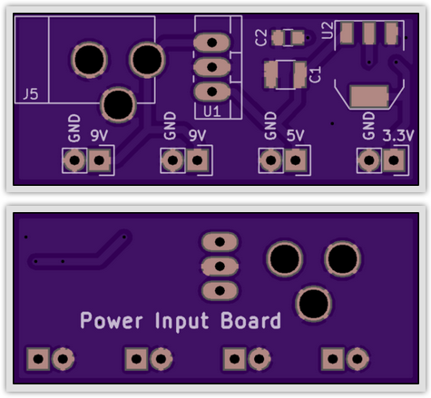

# Input Power Board

Breadboard-compatible board breaks out 9V, 5V, and 3.3V from a 9V battery.

### Bill of Materials

|Ref|Qty|Description|MF_Name|MF_PN|Digikey PN|
|---|---|-----------|-------|-----|----------|
|C1|1|CAP CER 0.1UF 50V C0G RADIAL|TDK FK26C0G1H104J|445-8532-ND|
|C2|1|CAP CER 10UF 25V X7R RADIAL|TDK FK16X7R1E106K|445-8351-ND|
|J1-J4|4|HEADER MALE 2POS TH 1x02 0.1"|Harwin|M20-9990246|952-2262-ND|
|J1A-J4A|4|CONN TERM SCREW GREEN 2.54MM 2POS TH|OnShoreTech|OSTVN02A150|ED10561-ND|
|J5|1|CONN PWR JACK 2.0X6.5MM HIGH CUR|Panasonic|PJ-202AH|CP-202AH-ND|
|U1|1|IC REG LDO 5V 1A NCP7805 TO220AB|ON Semi|NCP7805TG|NCP7805TGOS-ND|
|U2|1|IC REG LDO 3.3V 1A LD1117 TO220AB|STM|LD1117AV33|497-1485-5-ND|

