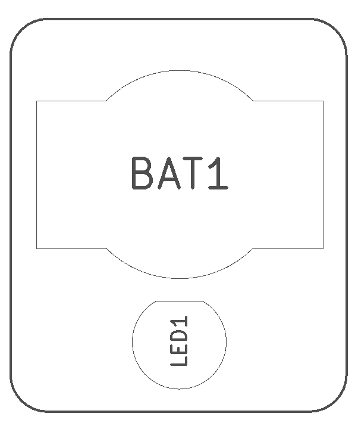
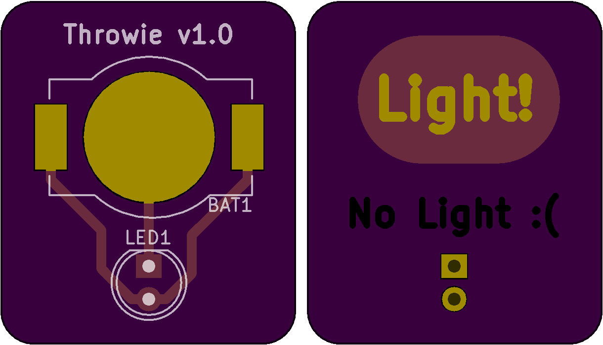

<!--- start title --->
# Simple Throwie Board v1.0
Example project to demonstrate manufacturing layers in KiCad

- Updated: 01 Apr 2017

- Author: Jenner Hanni
- Website: http://wickerbox.net
- Company: Wickerbox Electronics
- License: CERN Open Hardware License v1.2
<!--- end title --->

Description.

<!--- bom start --->
### Bill of Materials

|Ref|Qty|Description|Digikey PN|
|---|---|-----------|------|
|BAT1|1|CR1220 BATTERY HOLDER SMT FLATPIN|BK-916-CT-ND|
|LED1|1|LED RED DIFF 5MM ROUND T/H|1125-1188-ND|

<!--- bom end --->

